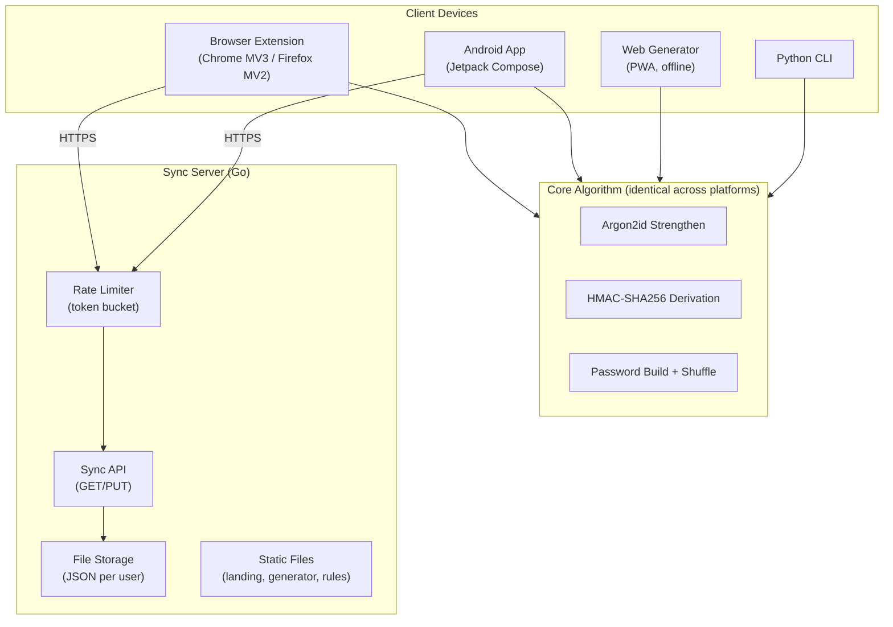
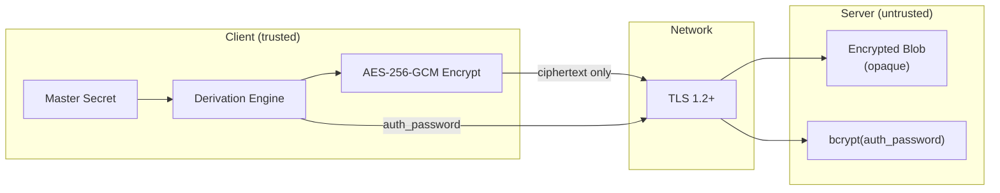
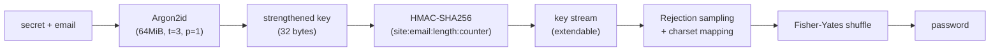

# Keygrain — System Architecture

## Core Design Principle

Keygrain is a **stateless derivation engine**: the same inputs (secret + email + site + params) always produce the same outputs. No password storage is required. Only service metadata (site name, length, symbols, counter) is stored, and that metadata is useless without the master secret.

## Architecture Diagram



## Security Boundaries



**Key invariant:** The server never sees plaintext secrets, encryption keys, or service data. It stores only opaque encrypted blobs and a bcrypt hash of the derived auth_password.

## Local Encryption (Extension)

The extension encrypts service data at rest in `chrome.storage.local`. This is distinct from sync encryption (which protects data on the server).

### Key Derivation Chain

```
secret + email
    → Argon2id(64MiB, t=3, p=1, salt="keygrain-strengthen:<email>")
    → strengthened (32 bytes)
    → HMAC-SHA256(strengthened, "<email>:keygrain-local-storage")
    → storageKey (32 bytes)
```

### Encryption Scheme

| Parameter | Value |
|-----------|-------|
| Algorithm | AES-256-GCM |
| Key | `storageKey` (derived above) |
| IV | 12 random bytes (per write) |
| AAD | `email.toLowerCase()` (UTF-8 encoded) |
| Plaintext | JSON: `{version: 1, services, wallets, wallet_audit_log}` |

### Stored Format (version 2)

```json
{"version": 2, "iv": "<base64>", "ciphertext": "<base64>"}
```

Stored at key `services` in `chrome.storage.local`. The `version: 2` envelope distinguishes encrypted storage from legacy plaintext (`version: 1` was unencrypted).

### PIN-Based Secret Encryption

The master secret itself can be encrypted with a user-chosen PIN for session persistence:

| Parameter | Value |
|-----------|-------|
| KDF | PBKDF2 (SHA-256, 100,000 iterations) |
| Salt | 16 random bytes |
| Derived key | AES-256-GCM (256-bit) |
| IV | 12 random bytes |
| Plaintext | The master secret (UTF-8) |

Functions: `pinEncryptSecret(pin, secret)` → `{encrypted, salt, iv}`, `pinDecryptSecret(pin, stored)`.

### Session Architecture

- Master secret and email are held in `chrome.storage.session` (memory-only, cleared on browser close).
- The `storageKey` is never persisted — re-derived on each popup open or background operation.
- Auto-lock alarm clears session storage after configurable idle (default: 15 min).
- Background sync and badge updates decrypt local storage on-demand using the session secret.

### Threat Model Distinction

| Layer | Protects against | Key source |
|-------|-----------------|------------|
| Sync encryption | Server compromise, network interception | `:keygrain-encryption` HMAC |
| Local encryption | Local disk access, extension storage dumps | `:keygrain-local-storage` HMAC |
| PIN encryption | Session theft (secret in memory) | PBKDF2 from user PIN |

## Derivation Pipeline



## Domain Separation

All derivations use the same strengthened key but produce independent outputs via unique HMAC messages:

| Derivation | HMAC message | Unique suffix |
|------------|-------------|---------------|
| Password | `site:email:length:counter` | Ends with decimal integer |
| Lookup ID | `email:keygrain-id` | `:keygrain-id` |
| Auth password | `email:32:keygrain-auth` | `:keygrain-auth` (reuses password derivation with length=32) |
| Encryption key | `email:keygrain-encryption` | `:keygrain-encryption` |
| Local storage key | `email:keygrain-local-storage` | `:keygrain-local-storage` |
| TOTP seed | `site:email:keygrain-totp` | `:keygrain-totp` |
| SSH key | `email:key_name:counter:keygrain-ssh` | `:keygrain-ssh` |
| Wallet | `email:wallet_name:chain:counter:keygrain-wallet` | `:keygrain-wallet` |
| Fingerprint | `keygrain-fingerprint` (key=raw secret, no Argon2id) | Standalone, different key material |

## Platform Architecture Patterns

| Pattern | Implementation |
|---------|---------------|
| Background persistence | Chrome: Service Worker; Firefox: Background scripts |
| Local encryption | Extension: Web Crypto API + PIN-derived key; Android: EncryptedSharedPreferences |
| Sync conflict resolution | ETag-based optimistic concurrency + per-service merge by UUID |
| Rate limiting | Dual token bucket: per-IP (100/min) + per-lookup_id (2/min) |
| Autofill | Content script with `Object.getOwnPropertyDescriptor` for React/Vue/Angular bypass |
| Cross-platform correctness | Shared `vectors.json` enforced by CI checksum gate |
