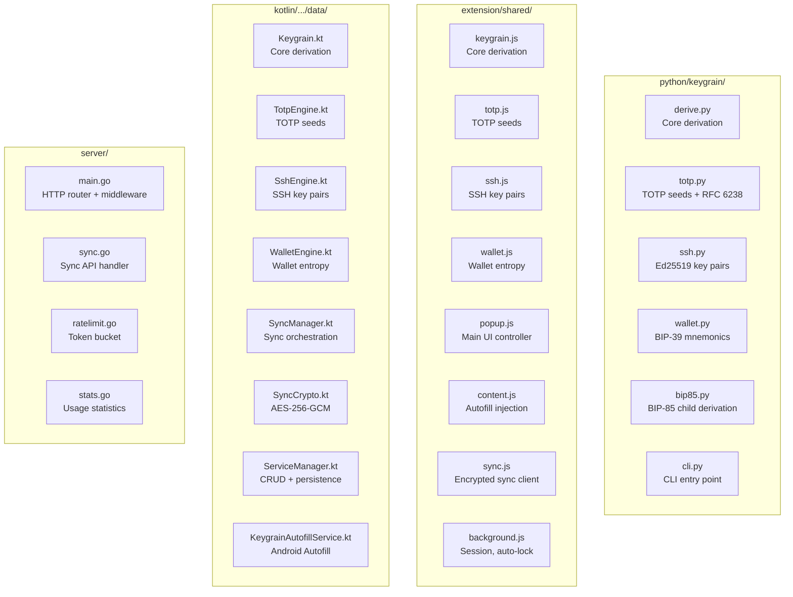

# Keygrain — Components

## Component Map

## Core Algorithm Components

### Python — `python/keygrain/`

| File | Responsibility |
|------|---------------|
| `derive.py` | `strengthen_secret()`, `derive_password()`, `normalize_site()`, `unbiased_index()` |
| `totp.py` | `derive_totp_seed()`, `parse_totp_input()`, `generate_totp()` (RFC 6238) |
| `ssh.py` | `derive_ssh_keypair()`, OpenSSH PEM + authorized_keys formatting |
| `wallet.py` | `derive_wallet_entropy()`, `entropy_to_mnemonic()`, `mnemonic_to_seed()` |
| `bip85.py` | `bip85_derive_mnemonic()` — BIP-85 child derivation from existing mnemonic |
| `cli.py` | Argument parsing, subcommands: `password`, `totp`, `ssh`, `wallet`, `wallet-bip85` |
| `_wordlist.py` | BIP-39 English wordlist (2048 words) |

### JavaScript — `extension/shared/`

| File | Responsibility |
|------|---------------|
| `keygrain.js` | `strengthenSecret()`, `derivePassword()`, `normalizeSite()`, `secretFingerprint()` |
| `totp.js` | `deriveTOTPSeed()`, `parseTOTPInput()`, `generateTOTP()` |
| `ssh.js` | `deriveSshKeypair()`, `formatAuthorizedKeys()` |
| `wallet.js` | `deriveWalletEntropy()`, `entropyToMnemonic()`, `mnemonicToSeed()` |
| `bip85.js` | `bip85DeriveMnemonic()`, `_ckdPriv()` (hardened child key) |
| `popup.js` | Full popup UI: service list, search, CRUD, fill, copy, settings |
| `popup-crypto.js` | PIN encrypt/decrypt, storage key derivation |
| `popup-search.js` | Fuzzy search with frecency scoring |
| `popup-breach.js` | Breach feed checking |
| `popup-rules.js` | Site rules (signed JSON) for auto-detect constraints |
| `popup-dialog.js` | Dialog state management |
| `sync.js` | Sync client: encrypt/decrypt blob, merge services, optimistic concurrency |
| `content.js` | Autofill: find password/username fields, inject values |
| `migrate.js` | Import from LastPass, Bitwarden, 1Password, Chrome, Firefox |
| `wallet-page.js` | Wallet derivation UI |
| `import.js` | File import UI |
| `lib/hash-wasm-argon2.js` | Argon2id WASM implementation |
| `lib/tweetnacl.js` | Ed25519 for SSH key derivation |

### Kotlin — `kotlin/app/src/main/java/com/badrani/keygrain/data/`

| File | Responsibility |
|------|---------------|
| `Keygrain.kt` | Core derivation: strengthen, derive password, fingerprint, auth credentials |
| `TotpEngine.kt` | TOTP seed derivation, OTPAuth URI parsing, code generation |
| `SshEngine.kt` | SSH keypair derivation, OpenSSH formatting |
| `WalletEngine.kt` | Wallet entropy, BIP-39 mnemonic, seed derivation |
| `SyncManager.kt` | Full sync orchestration: encrypt, merge, conflict resolution, audit log |
| `SyncCrypto.kt` | AES-256-GCM encrypt/decrypt |
| `ServiceManager.kt` | Service CRUD, JSON persistence, frecency tracking |
| `SecretManager.kt` | Master secret storage (EncryptedSharedPreferences) |
| `PublicSuffixList.kt` | eTLD+1 extraction for autofill domain matching |
| `KeygrainAutofillService.kt` | Android Autofill Framework integration |
| `KeygrainCredentialProvider.kt` | Android Credential Manager integration |
| `CredentialSelectionActivity.kt` | Credential picker UI for autofill |

### Kotlin UI — `kotlin/app/src/main/java/com/badrani/keygrain/ui/screens/`

| File | Responsibility |
|------|---------------|
| `MainScreen.kt` | Unlock screen + service list (biometric, search, sync, CRUD) |
| `OnboardingScreen.kt` | 5-step first-run wizard |
| `WalletScreen.kt` | HD wallet derivation UI |
| `HelpScreen.kt` | FAQ cards |

## Server Components

| File | Responsibility |
|------|---------------|
| `main.go` | HTTP server setup, routing, middleware chain, graceful shutdown |
| `sync.go` | Sync API: GET/PUT with auth, ETag, UUID assignment, validation |
| `ratelimit.go` | Dual token-bucket: per-IP + per-lookup_id, configurable via env vars |
| `stats.go` | User count endpoint (counts JSON files in data dir) |
| `deploy/setup-server.sh` | Provision server: Docker, nginx, certbot, firewall |
| `deploy/deploy.sh` | Pull image, restart container |

## Cross-Platform Enforcement

| File | Purpose |
|------|---------|
| `vectors.json` | Password derivation + strengthen + fingerprint vectors |
| `totp-vectors.json` | TOTP derivation + RFC 6238 vectors |
| `ssh-vectors.json` | SSH key derivation vectors |
| `wallet-vectors.json` | Wallet entropy + mnemonic vectors |
| `.vectors-checksum` | SHA-256 of vectors.json (CI gate) |
| `.spec-checksum` | SHA-256 of SPEC.md (CI gate) |
| `.test-baselines` | Minimum test counts per platform |
| `ci/cross-platform-check.sh` | Run Python + Node derivation, compare outputs |
| `ci/cross-platform-derive.py` | Python side of cross-platform check |
| `ci/cross-platform-derive.mjs` | Node.js side of cross-platform check |
