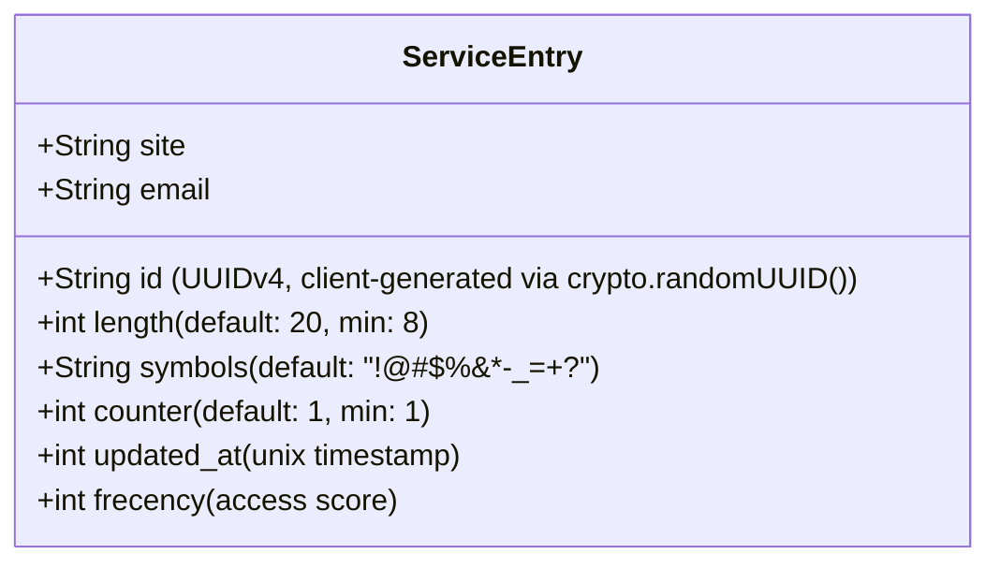
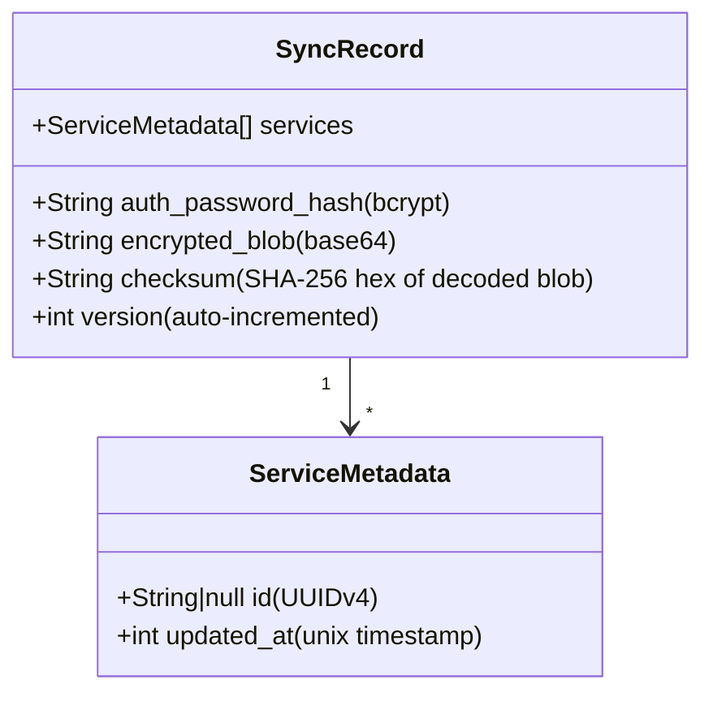
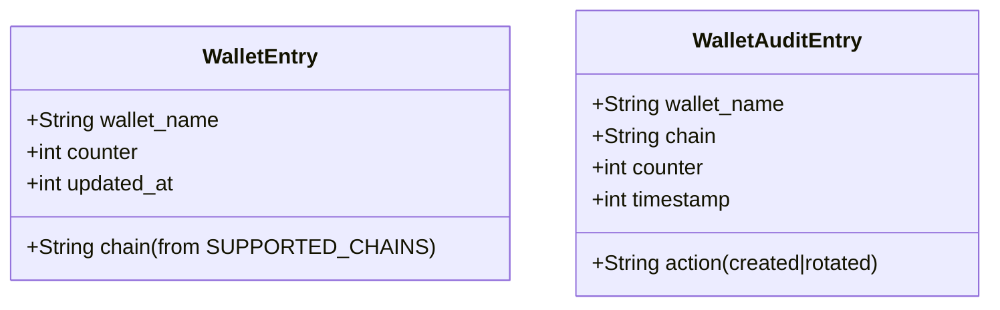
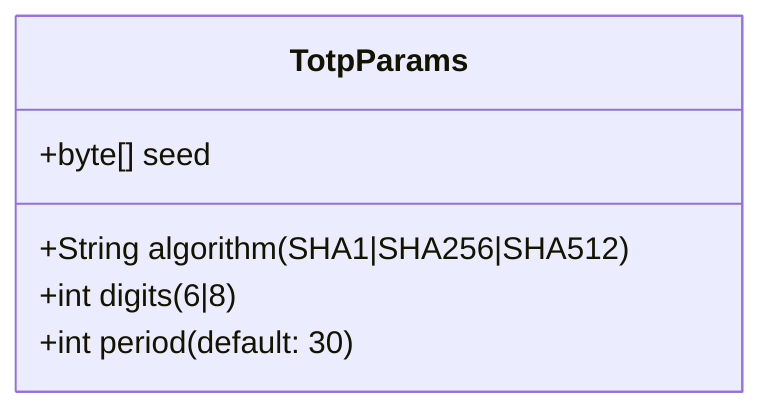
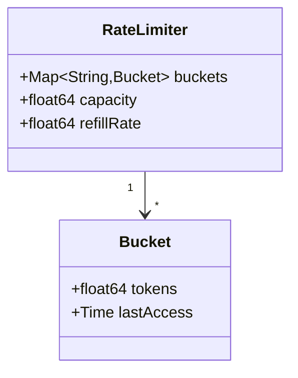
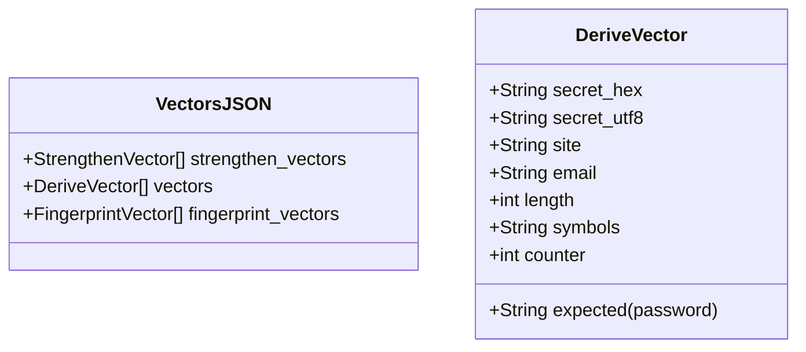

# Keygrain — Data Models

## Service Entry

Stored per-device (extension: `chrome.storage.local`, Android: EncryptedSharedPreferences). Synced encrypted.



## Sync Blob (Server-Side)

On-disk format: one JSON file per user at `data/<lookup_id>.json`.



**Note:** `services` metadata (IDs + timestamps) is plaintext for merge logic. All actual service data (site, email, length, symbols) is inside `encrypted_blob` — opaque to the server.

## Encrypted Blob Format

```
base64( IV[12 bytes] || AES-256-GCM(plaintext) || GCM-tag[16 bytes] )
```

- Key: `HMAC-SHA256(strengthened, email + ":keygrain-encryption")`
- Plaintext: JSON array of full service entries + wallet audit log

## Wallet Data Models



Supported chains: `bitcoin`, `ethereum`, `solana`, `litecoin`, `dogecoin`, `bitcoin-testnet`, `polkadot`, `cosmos`, `avalanche`

## TOTP Input Formats

The TOTP parser accepts multiple input formats:

| Format | Example | Handling |
|--------|---------|----------|
| OTPAuth URI | `otpauth://totp/GitHub:user?secret=BASE32&digits=6` | Full parse: algorithm, digits, period |
| Base32 seed | `JBSWY3DPEHPK3PXP` | SHA1, 6 digits, 30s period |
| Hex seed | `48656c6c6f21` | SHA1, 6 digits, 30s period |



## Rate Limiter State



Two instances: one keyed by IP, one keyed by lookup_id. Stale buckets evicted periodically.

## Test Vector Format



Separate files: `totp-vectors.json`, `ssh-vectors.json`, `wallet-vectors.json` follow similar patterns.
