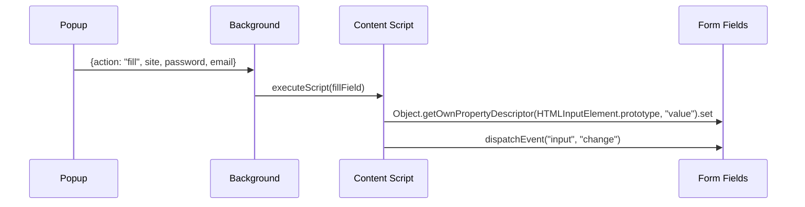

# Keygrain — Interfaces and APIs

## Sync API (HTTP)

Base URL: `https://keygrain.com` (or `localhost:9860` for development)

### Endpoints

| Method | Path | Auth | Purpose |
|--------|------|------|---------|
| GET | `/api/sync/:lookup_id` | Basic | Retrieve encrypted sync state |
| PUT | `/api/sync/:lookup_id` | Basic | Push new sync state |
| GET | `/health` | None | Liveness check |
| GET | `/api/stats` | None | User count |

### Authentication

HTTP Basic with derived credentials:
- Username: `lookup_id` = `hex(HMAC-SHA256(strengthened, email + ":keygrain-id"))` (64 hex chars)
- Password: `auth_password` = derived password with `salt="keygrain-auth"`, length=32

Server stores bcrypt(auth_password) on first PUT.

### Concurrency Control

ETag-based optimistic concurrency:
- GET returns `ETag` header (SHA-256 of blob, first 16 bytes, hex)
- PUT requires `If-Match` header matching current ETag
- 409 Conflict on mismatch, includes `current_etag` for re-fetch

### Rate Limiting

| Scope | Burst | Refill |
|-------|-------|--------|
| Per IP | 100 | 100/min |
| Per lookup_id | 10 | 2/min |

429 responses include `Retry-After` header.

## Python Library API

```python
from keygrain import (
    derive_password, strengthen_secret, normalize_site, clear_strengthen_cache,
    derive_totp_seed, parse_totp_input, generate_totp,
    derive_ssh_keypair, format_openssh_private_key, format_authorized_keys,
    derive_wallet_entropy, entropy_to_mnemonic, mnemonic_to_seed, derive_wallet_mnemonic,
    bip85_derive_mnemonic,
    DEFAULT_SYMBOLS, SUPPORTED_CHAINS, BIP44_PATHS,
)
```

### Core Functions

| Function | Signature | Returns |
|----------|-----------|---------|
| `strengthen_secret` | `(secret: bytes, email: str) -> bytes` | 32-byte Argon2id hash |
| `derive_password` | `(secret: bytes, email: str, *, site: str, length: int = 20, symbols: str = DEFAULT_SYMBOLS, counter: int = 1) -> str` | Password string |
| `normalize_site` | `(site: str) -> str` | Cleaned site identifier |
| `derive_totp_seed` | `(secret: bytes, email: str, site: str) -> bytes` | 32-byte TOTP seed |
| `generate_totp` | `(seed: bytes, time: int, *, digits: int = 6, period: int = 30, algorithm: str = "SHA1") -> str` | TOTP code |
| `parse_totp_input` | `(input_str: str) -> dict` | {seed, digits, period, algorithm, issuer, label} |
| `derive_ssh_keypair` | `(secret: bytes, email: str, *, key_name: str, counter: int = 1) -> tuple[bytes, bytes]` | (seed, public_key) |
| `format_openssh_private_key` | `(seed: bytes, public_key: bytes, comment: str) -> str` | PEM private key |
| `format_authorized_keys` | `(public_key: bytes, comment: str) -> str` | authorized_keys line |
| `derive_wallet_entropy` | `(secret: bytes, email: str, *, wallet_name: str, chain: str, counter: int = 1) -> bytes` | 32-byte entropy |
| `entropy_to_mnemonic` | `(entropy: bytes) -> str` | 24-word mnemonic |
| `mnemonic_to_seed` | `(mnemonic: str, passphrase: str = "") -> bytes` | 64-byte BIP-32 seed |
| `derive_wallet_mnemonic` | `(secret: bytes, email: str, *, wallet_name: str, chain: str, counter: int = 1) -> str` | 24-word mnemonic |

## CLI Interface

Uses subcommands. Master secret is read from `$KEYGRAIN_SECRET` (override with `--secret-env`).

```
keygrain password <email> --site <site> [--length N] [--symbols S] [--counter N]
keygrain ssh <email> --name <key_name> [--counter N] [--private | --agent]
keygrain wallet <email> --name <name> --chain <chain> [--counter N] [--raw | --seed | --path] [--yes-i-understand-the-risks]
keygrain wallet-bip85 --mnemonic <mnemonic> [--words 12|24] [--index N] [--passphrase S]
keygrain totp --seed <seed> [--digits 6|8] [--period N]
keygrain totp --derive --email <email> --site <site> [--digits 6|8] [--period N]
```

Legacy shorthand (no subcommand) is equivalent to `password`:
```
keygrain <email> --site <site> [--length N] [--symbols S] [--counter N]
```

## JavaScript API (Extension)

### Core (`keygrain.js`)

| Function | Async | Returns |
|----------|-------|---------|
| `strengthenSecret(secret, email)` | Yes | `Uint8Array(32)` |
| `derivePassword(secret, email, {site, length?, symbols?, counter?})` | Yes | `string` |
| `normalizeSite(site)` | No | `string` |
| `secretFingerprint(secret)` | Yes | `number[4]` (color indices) |
| `deriveAuthPassword(secret, email)` | Yes | `string` |
| `estimateEntropy(secret)` | No | `number` (bits) |

### Sync (`sync.js`)

| Function | Async | Returns |
|----------|-------|---------|
| `deriveLookupId(secret, email)` | Yes | `string` (64 hex) |
| `deriveEncryptionKey(secret, email)` | Yes | `Uint8Array(32)` |
| `encryptBlob(keyBytes, plaintext, additionalData)` | Yes | `Uint8Array` |
| `decryptBlob(keyBytes, blob, additionalData)` | Yes | `Uint8Array` |
| `syncWithServer(secret, email, localServices, localWallets?, localAuditLog?, retryCount?)` | Yes | `{services, wallets, wallet_audit_log, sync_conflicts, status, etag, knownUUIDs}` |
| `mergeServices(localServices, remoteServices, remoteMetadata, knownUUIDs)` | No | `{merged, knownUUIDs, sync_conflicts}` |

### Background (`background.js`)

Message-based communication between popup and background:
- `{action: "getSecret"}` → `{secret: string|null}`
- `{action: "setSecret", secret}` → stores in session, starts auto-lock timer and sync alarm
- `{action: "clearSecret"}` → clears session, stops timers, locks
- `{action: "heartbeat"}` → resets auto-lock timer
- `{action: "getEmail"}` → `{email: string|null}`
- `{action: "setEmail", email}` → stores email in session
- `{action: "clearEmail"}` → removes email from session
- `{action: "refreshBadge"}` → updates badge count for active tab
- `{action: "scheduleSyncRetry", errorType}` → schedules exponential retry alarm

## Kotlin API

### Core (`Keygrain.kt`)

| Function | Returns |
|----------|---------|
| `strengthenSecret(secret: ByteArray, email: String): ByteArray` | 32-byte hash |
| `derivePassword(secret: ByteArray, email: String, site: String, length: Int, symbols: String, counter: Int): String` | Password |
| `normalizeSite(site: String): String` | Cleaned site |
| `secretFingerprint(secretBytes: ByteArray): IntArray` | 4 color indices |
| `deriveLookupId(secret: ByteArray, email: String): String` | 64 hex chars |
| `deriveAuthPassword(secret: ByteArray, email: String): String` | Auth password |
| `deriveEncryptionKey(secret: ByteArray, email: String): ByteArray` | 32-byte key |

### Sync (`SyncManager.kt`)

Sealed class result types: `SyncResult.Success`, `SyncResult.AuthError`, `SyncResult.ServerError`, `SyncResult.NetworkError`, `SyncResult.IntegrityError`, `SyncResult.ConflictError`

## Browser Extension Messaging

### Content Script ↔ Popup

The popup injects credentials directly via `chrome.scripting.executeScript` (Chrome) or `browser.tabs.executeScript` (Firefox). No content script messaging protocol — the content script provides field-finding utilities.

### Autofill Strategy



Uses native property descriptors to bypass React/Vue/Angular controlled inputs.

## Error Handling Patterns

### Python — `ValueError` / `RuntimeError`

All validation errors raise `ValueError` with a descriptive message. Pattern is fail-fast at function entry:

```python
raise ValueError("secret must not be empty")
raise ValueError("length must be between 8 and 128")  # derive.py uses "Error: ..." prefix
raise ValueError(f"Unsupported algorithm: {algorithm}")
raise ValueError(f"Cannot parse TOTP input: {input_str!r}")
```

`RuntimeError` is used only for integrity failures (e.g., BIP-39 wordlist checksum).

### JavaScript — `RangeError` / `Error` / `MetadataTamperError`

Input validation in `keygrain.js` uses `RangeError`:
```js
throw new RangeError("secret must not be empty");
throw new RangeError("length must be between 8 and 128");
throw new RangeError("symbols must not be empty");
```

Runtime/crypto errors and all other modules use plain `Error`:
```js
throw new Error("stream exhausted");          // keygrain.js
throw new Error("Invalid child key (zero)");  // bip85.js
throw new Error("Empty base32 input");        // totp.js
```

Sync-specific: `MetadataTamperError` (extends `Error`) thrown when server metadata integrity check fails. Contains a `violations` array. Runtime sync errors use coded strings: `"network_error"`, `"checksum_mismatch"`, `"metadata_length_mismatch"`, `"auth_failed"`.

### Go Server — JSON Error Responses

All errors return `Content-Type: application/json` via `jsonError(w, body, code)`.

**Standard shape:** `{"error": "<message>"}`

**Validation (422):** `{"error": "validation failed", "detail": "<specific reason>"}`

| Status | Error | Context |
|--------|-------|---------|
| 400 | `invalid lookup_id`, `invalid json`, `invalid If-Match header` | Request parsing |
| 401 | `unauthorized` | Auth failure |
| 404 | `not found` | Unknown lookup_id on GET |
| 405 | `method not allowed` | Wrong HTTP method |
| 409 | `conflict` + `current_etag` field | ETag mismatch on PUT |
| 413 | `payload too large` | Body > 1 MB |
| 422 | `validation failed` + `detail` | Services/blob validation |
| 429 | `rate limit exceeded` + `retry_after` (int, seconds) | Rate limit; includes `Retry-After` header |
| 500 | `internal error` | DB/crypto failures |

Conflict response includes extra field: `{"error":"conflict","current_etag":"<hex>"}`.
Rate limit response includes extra field: `{"error":"rate limit exceeded","retry_after":30}`.

### Kotlin — Sealed Class `SyncResult`

```kotlin
sealed class SyncResult {
    data class Success(...) : SyncResult()
    data class AuthError(val httpCode: Int) : SyncResult()
    data class NetworkError(val cause: Throwable) : SyncResult()
    data class ServerError(val httpCode: Int, val body: String) : SyncResult()
    data class IntegrityError(val detail: String) : SyncResult()
    data object ConflictError : SyncResult()
}
```

Consumers pattern-match with `when (result) { is SyncResult.AuthError -> ... }`. No exceptions thrown for expected failure paths.