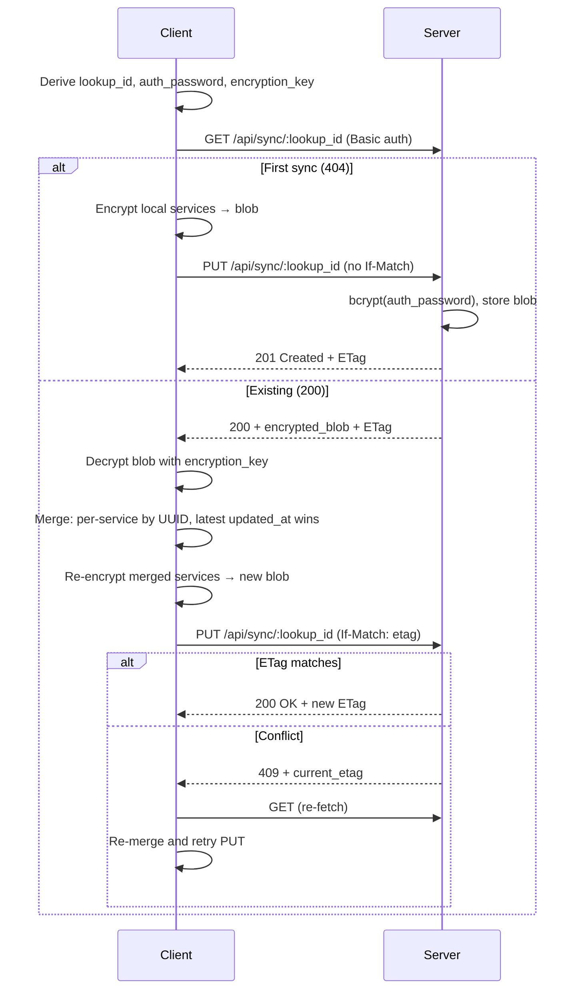
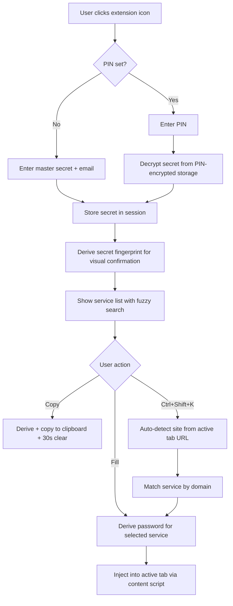
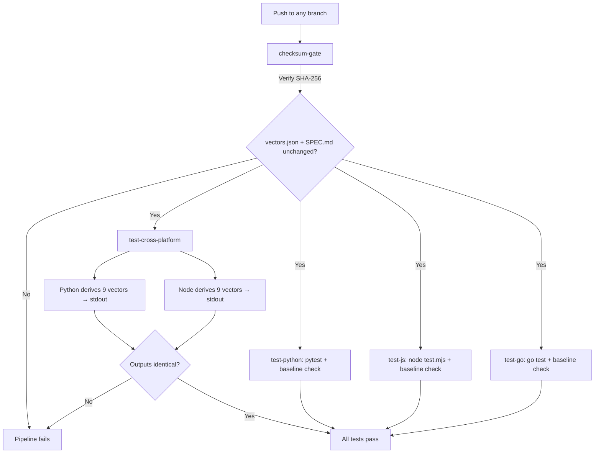
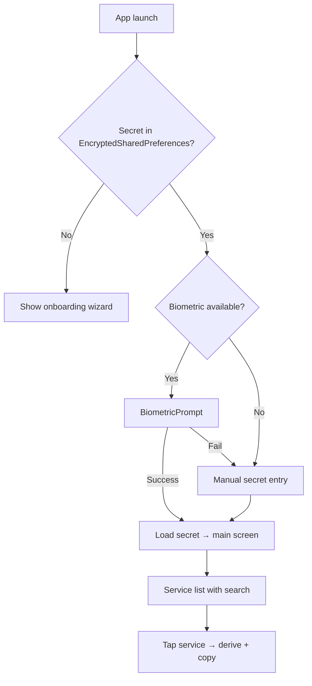
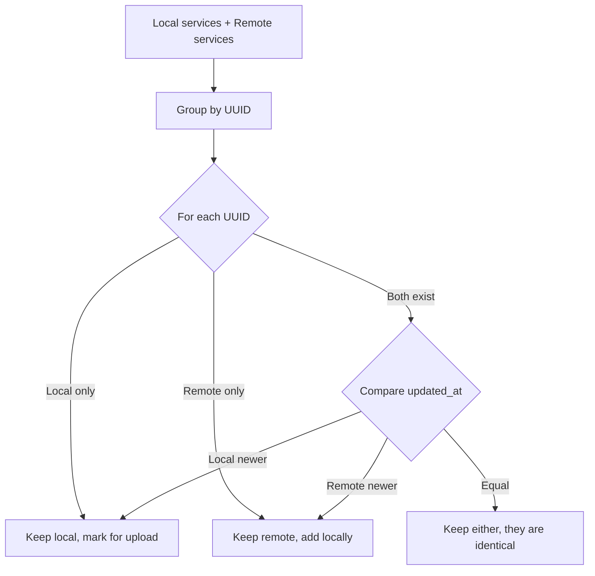
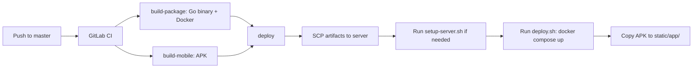

# Keygrain — Workflows

## Password Derivation Flow

```mermaid
flowchart TD
    A[User provides secret + email + site + params] --> B{Strengthen cache hit?}
    B -->|Yes| D[Use cached strengthened key]
    B -->|No| C[Argon2id: secret + salt=keygrain-strengthen:email]
    C --> D
    D --> E[Build message: site:email:length:counter]
    E --> F[HMAC-SHA256: key=strengthened, msg=message]
    F --> G[Stream: key || HMAC(key, counter) extensions]
    G --> H[Force 1 char per category: UPPER, LOWER, DIGIT, SYMBOL]
    H --> I[Fill remaining from full charset via rejection sampling]
    I --> J[Fisher-Yates shuffle]
    J --> K[Return password string]
```

## Sync Flow (Extension/Mobile)



## Extension Unlock + Autofill Flow



## Cross-Platform Test Verification (CI)



## Mobile Biometric Unlock Flow



## Service Merge Strategy

Per-service merge by UUID, latest `updated_at` wins:



## Deployment Flow


