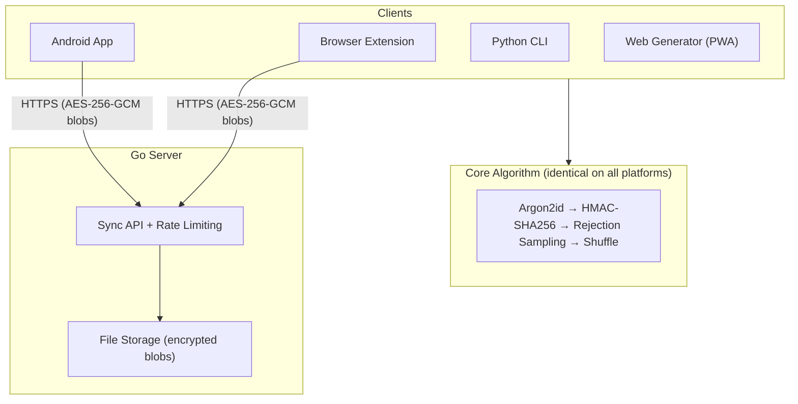

# AGENTS.md — Keygrain

Deterministic password, SSH key, TOTP seed, and HD wallet derivation from a master secret. No vault — same inputs always produce same outputs across all platforms.

## Directory Map

```
keygrain/
├── python/keygrain/       # Reference implementation (Python 3.10+, pip-installable)
│   ├── derive.py          #   Core: strengthen, derive_password, normalize_site
│   ├── totp.py            #   TOTP seed derivation + RFC 6238
│   ├── ssh.py             #   Ed25519 SSH keypair derivation
│   ├── wallet.py          #   BIP-39 mnemonic derivation
│   ├── bip85.py           #   BIP-85 child mnemonic from parent
│   └── cli.py             #   CLI entry point (subcommands: password, totp, ssh, wallet)
├── extension/             # Browser extension
│   ├── shared/            #   All JS logic (popup, sync, crypto, autofill, migrate)
│   ├── chrome/            #   MV3 manifest + service worker background.js
│   └── firefox/           #   MV2 manifest + background scripts
├── kotlin/app/            # Android app (Jetpack Compose, Material 3)
│   └── src/main/java/com/badrani/keygrain/
│       ├── data/          #   Engines: Keygrain, TotpEngine, SshEngine, WalletEngine,
│       │                  #   SyncManager, ServiceManager, PublicSuffixList, Autofill
│       └── ui/screens/    #   MainScreen, OnboardingScreen, WalletScreen, HelpScreen
├── server/                # Go sync server (single binary)
│   ├── sync.go            #   Sync API: GET/PUT with ETag concurrency
│   ├── ratelimit.go       #   Dual token bucket (per-IP + per-lookup_id)
│   ├── main.go            #   Router, middleware, graceful shutdown
│   └── static/            #   Website: landing, generator PWA, security, FAQ
├── ci/                    # Cross-platform test scripts
├── designs/               # 80+ design documents (historical context)
├── SPEC.md                # ⚠️ AUTHORITATIVE algorithm specification (v4)
├── API.md                 # Sync API reference
├── vectors.json           # Cross-platform test vectors (CI-checksummed)
└── .gitlab-ci.yml         # CI pipeline definition
```

## Architecture Overview



**Security invariant:** The server never sees plaintext. It stores opaque encrypted blobs + bcrypt(auth_password).

## Key Patterns That Deviate from Defaults

### Cross-Platform Correctness Enforcement

All platforms MUST produce byte-identical output. Enforced by:
1. **Checksum gate** — CI verifies SHA-256 of `vectors.json` and `SPEC.md` against `.vectors-checksum` / `.spec-checksum`. Modifying vectors or spec without updating checksums fails the pipeline.
2. **Test baselines** — `.test-baselines` enforces minimum test counts (python=128, js=85, kotlin=42, go=37). Test count regression = CI failure.
3. **Cross-platform job** — Runs Python + Node.js derivation on same inputs, diffs outputs.

### Zero NPM Dependencies (Extension)

The extension uses no package manager. Two vendored WASM/JS libs:
- `lib/hash-wasm-argon2.js` — Argon2id WASM
- `lib/tweetnacl.js` — Ed25519

All crypto via Web Crypto API (`crypto.subtle`).

### Domain Separation

All derivation types share one strengthened key but use unique HMAC message suffixes (`:keygrain-id`, `:keygrain-totp`, `:keygrain-ssh`, `:keygrain-wallet`, `:keygrain-local-storage`, etc.). Password messages end with an integer; all others end with named suffixes. See SPEC.md §14.

### Rejection Sampling (Spec v4)

Character selection uses `unbiased_index(n)` which discards bytes ≥ `floor(256/n)*n`. This eliminates modulo bias. Stream extends on demand via HMAC-SHA256 rounds with 4-byte big-endian counter.

### Autofill Technique

Content script uses `Object.getOwnPropertyDescriptor(HTMLInputElement.prototype, "value").set` to bypass React/Vue/Angular controlled inputs. This is why `scripting` permission is needed.

## CI/CD Pipeline

```
checksum-gate → test-python ─┐
                test-js      ├→ build-extension ─┐
                test-js-slow │   build-package   ├→ deploy (master only)
                test-go      │   build-mobile ───┘
                test-cross  ─┘
```

- **build-extension**: `extension/build.sh` → `dist/keygrain-chrome.zip`, `dist/keygrain-firefox.zip`
- **build-mobile**: Gradle `testReleaseUnitTest` + `assembleRelease` → `keygrain.apk`
- **deploy**: SCP to server → Docker restart

## Config Files That Matter

| File | What agents should know |
|------|------------------------|
| `SPEC.md` | Read this before modifying ANY derivation logic |
| `.test-baselines` | Update when adding tests (never decrease) |
| `.vectors-checksum` | Update via `sha256sum vectors.json` when vectors change |
| `.spec-checksum` | Update via `sha256sum SPEC.md` when spec changes |
| `vectors.json` | Add vectors when adding derivation behavior |
| `extension/build.sh` | Deterministic zip (fixed timestamps for reproducible builds) |
| `server/Dockerfile` | Multi-stage: Go build → Alpine runtime, port 9860 |
| `kotlin/app/build.gradle.kts` | compileSdk=34, minSdk=26, Kotlin 1.9.22, Compose BOM 2024.02 |

## Platform Feature Equivalence

| Feature | Python | JS (Extension) | Kotlin (Android) |
|---------|--------|----------------|------------------|
| Password derivation | ✅ | ✅ | ✅ |
| TOTP seeds | ✅ | ✅ | ✅ |
| SSH keys | ✅ | ✅ | ✅ |
| HD wallets | ✅ | ✅ | ✅ |
| BIP-85 | ✅ | ✅ | ❌ |
| Sync client | ❌ | ✅ | ✅ |
| Autofill | ❌ | ✅ | ✅ (Autofill Framework) |
| PIN unlock | ❌ | ✅ | ❌ (biometric instead) |
| Migration import | ❌ | ✅ | ❌ |

## Sync Protocol (Quick Reference)

- Auth: HTTP Basic (`lookup_id` : `auth_password`, both derived from secret+email)
- Encryption: AES-256-GCM, key = `HMAC-SHA256(strengthened, email + ":keygrain-encryption")`
- Concurrency: ETag-based optimistic locking (409 on conflict → re-fetch → re-merge → retry)
- Merge: Per-service by UUID, latest `updated_at` wins
- Rate limit: Dual token bucket — per-lookup_id (burst=10, refill=2/min), per-IP (burst=100, refill=100/min)

## Detailed Documentation

See `.agents/summary/index.md` for a complete documentation index with per-file guidance.

- **Developer Workflows** — `.agents/summary/developer_workflows.md`: Step-by-step procedures for adding derivation types, test vectors, modifying sync protocol, adding platforms, and deploying the server.

## Custom Instructions
<!-- This section is for human and agent-maintained operational knowledge.
     Add repo-specific conventions, gotchas, and workflow rules here.
     This section is preserved exactly as-is when re-running codebase-summary. -->
