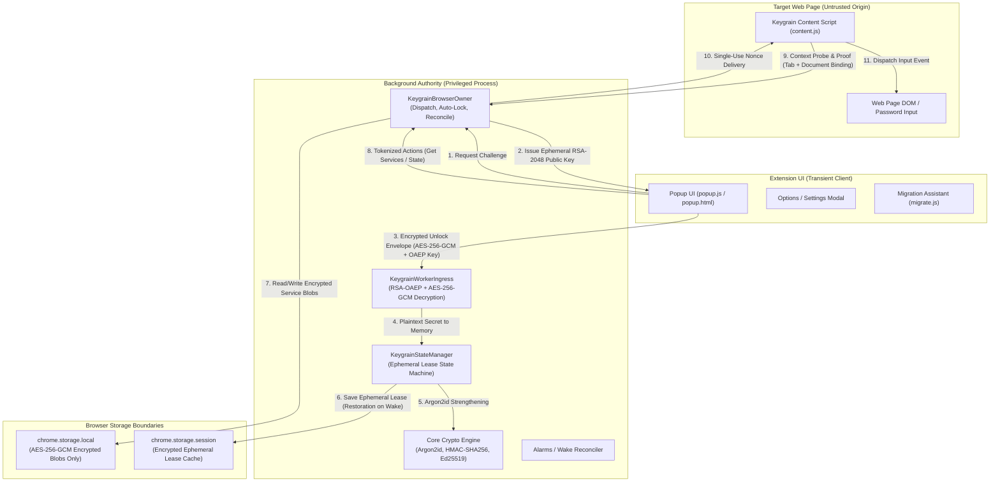
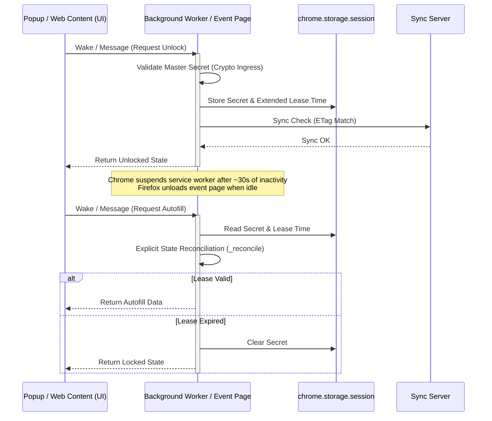
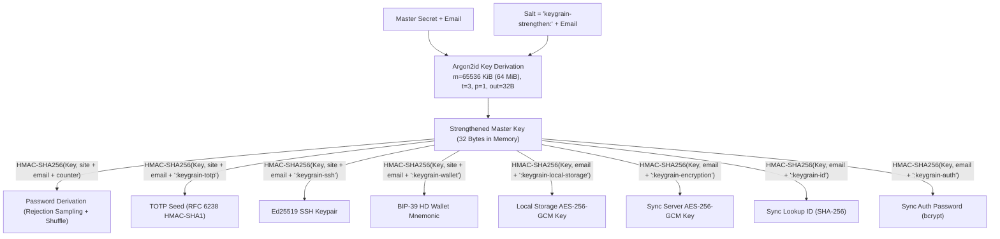
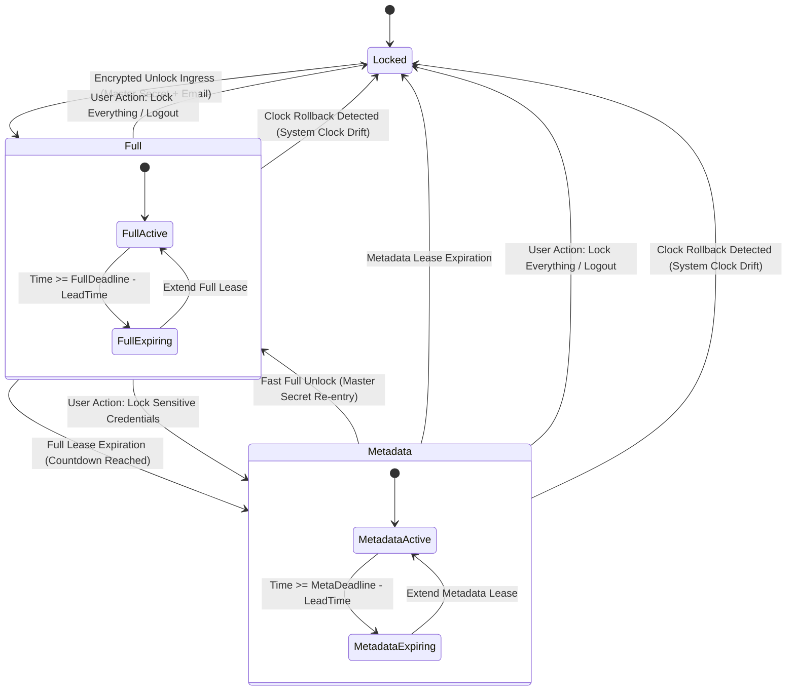
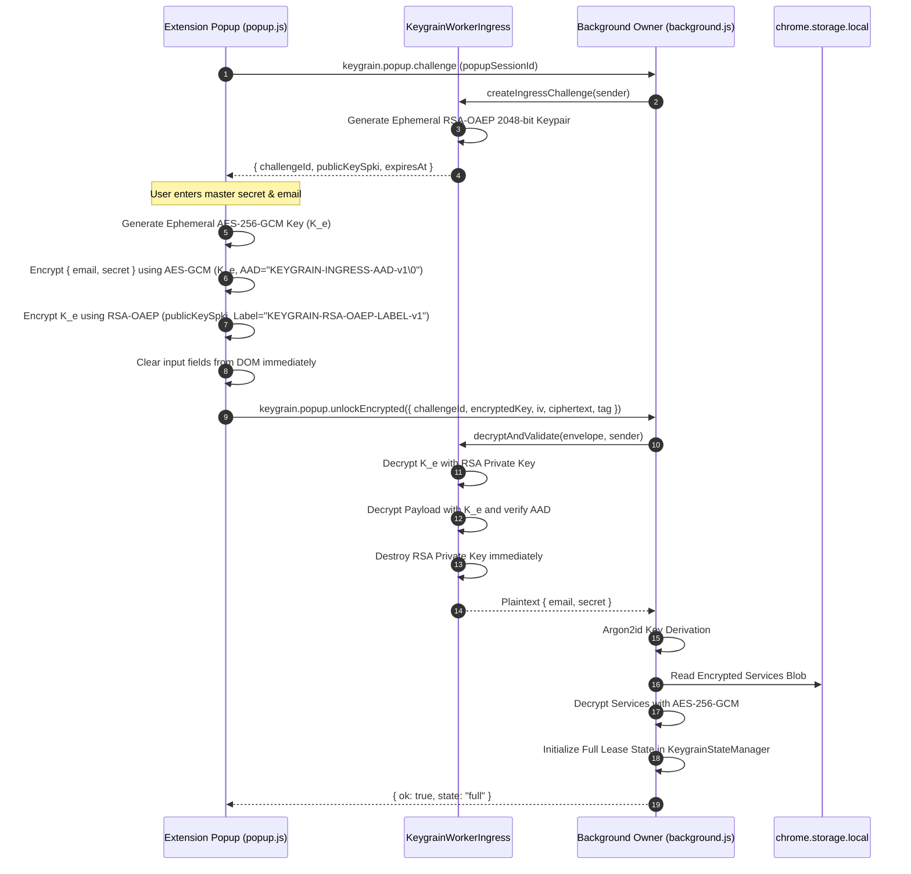
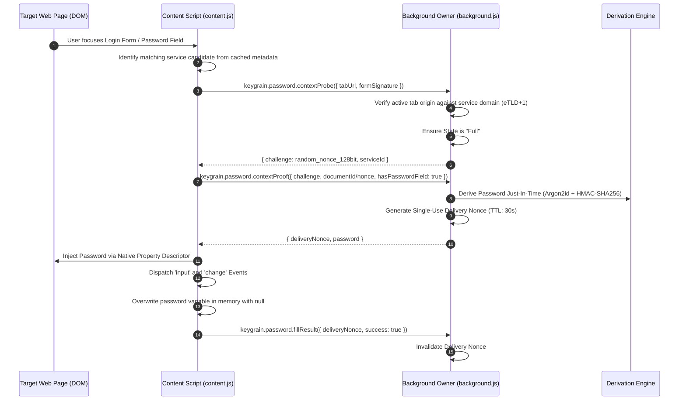
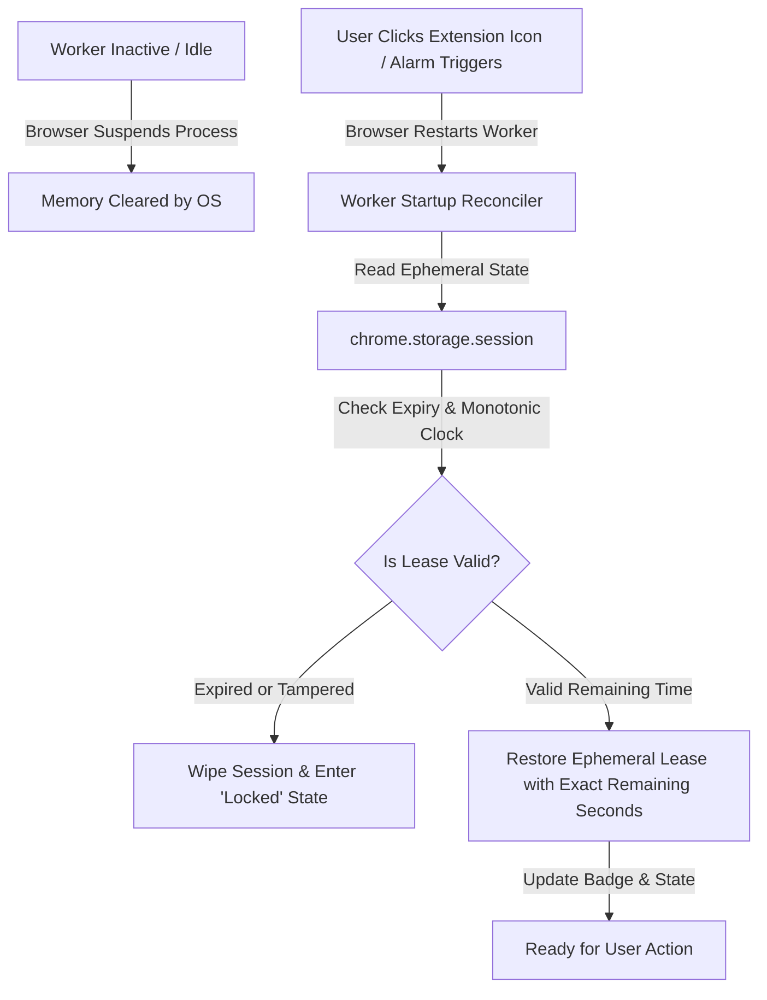

# Keygrain Browser Extension — Architecture & Lifecycle Specification

## 1. Executive Summary & Core Philosophy

The Keygrain browser extension is built on a **Worker-Authoritative Execution Model** with **Zero Plaintext Persistence** and **Ephemeral Dual-Tier Lease State Machines**. Unlike conventional password managers that persist static password vaults locally or synchronize unencrypted records across processes, Keygrain derives cryptographic secrets (passwords, TOTP seeds, Ed25519 SSH keys, BIP-39 cryptocurrency wallets) on demand directly from a single master secret combined with service metadata.

All sensitive cryptographic operations, lease enforcement, and credential derivations occur strictly within the privileged background context (Service Worker in Chrome, Event Page in Firefox). Untrusted extension projection clients (popup, options, content scripts) communicate with the background worker using cryptographically separated ingress envelopes and bounded single-use nonces.



---

## 2. Manifest V3 Background Lifecycle Divergence

A critical architectural split exists between Chromium browsers and Mozilla Firefox under Manifest V3 (MV3). The background execution models operate under fundamentally different lifecycles and messaging primitives.



### 2.1 Chrome: Ephemeral Service Workers

- **Lifecycle & Execution Window**: Chrome MV3 background scripts run as standard Web Service Workers (`service_worker` in `manifest.json`). They are stateless and ephemeral; the browser forcibly terminates worker processes after approximately 30 seconds of inactivity or during memory pressure.
- **State Reconstitution**: Background worker memory is lost on termination. To preserve active session leases across worker restarts without writing secrets to persistent disk, `KeygrainStateManager` writes encrypted ephemeral lease state to `chrome.storage.session`. When woken up by an alarm, message, or user action, the background worker restores its in-memory lease and state directly from session storage.
- **IPC Messaging Protocol**: Asynchronous runtime message listeners (`chrome.runtime.onMessage.addListener`) **must return `true`** synchronously to signal to the browser that the response channel will be answered asynchronously via `sendResponse`.

### 2.2 Firefox: Event Pages (MV3)

- **Lifecycle & Execution Model**: Firefox MV3 utilizes non-persistent Background Event Pages (`scripts` in `manifest.json`). While they unload when idle, their lifecycle hooks and runtime messaging semantics differ significantly from Chrome.
- **Promise-Based IPC**: In Firefox MV3, asynchronous message listeners **must return a `Promise`** (such as `startupPromise.then(...)`) rather than returning `true`. Returning `true` causes the IPC channel to immediately close before asynchronous processing completes, causing autofill and unlock timeouts.
- **Unified Session API**: Firefox supports `browser.storage.session` (in-memory, cleared on browser exit). The background implementation leverages this to maintain a unified state cache between both browser builds.

> [!IMPORTANT]
> **Architectural Separation**: `extension/chrome/background.js` and `extension/firefox/background.js` must remain separate entrypoints. Attempting to merge them into a single monolithic script breaks asynchronous IPC semantics across browser runtimes.

---

## 3. Cryptographic Domain Separation

Keygrain enforces strict cryptographic domain separation across all derived secrets. Every derivation branches from the root Argon2id-strengthened key using a unique domain suffix and purpose label in HMAC-SHA256.



### 3.1 Domain Separation Registry

| Purpose | HMAC-SHA256 Derivation Input | Output / Encoding | Description |
| :--- | :--- | :--- | :--- |
| **Password Derivation** | `site.toLowerCase() + ":" + email.toLowerCase() + ":" + length + ":" + counter` | Charset mapped & Fisher-Yates shuffled | Dynamic site passwords |
| **TOTP Seed** | `site.toLowerCase() + ":" + email.toLowerCase() + ":keygrain-totp"` | 20 bytes Base32 RFC 6238 | Two-factor authentication seeds |
| **SSH Keypair** | `site.toLowerCase() + ":" + email.toLowerCase() + ":keygrain-ssh"` | 32 bytes RFC 8032 Ed25519 / OpenSSH | Deterministic SSH keys |
| **HD Wallet** | `site.toLowerCase() + ":" + email.toLowerCase() + ":keygrain-wallet"` | BIP-39 English 12/24 words | Cryptocurrency seed mnemonics |
| **Local Storage Key** | `email.toLowerCase() + ":keygrain-local-storage"` | 32 bytes AES-256-GCM key | Encrypts `chrome.storage.local` data |
| **Sync Encryption Key** | `email.toLowerCase() + ":keygrain-encryption"` | 32 bytes AES-256-GCM key | Encrypts sync blobs for server |
| **Lookup ID** | `email.toLowerCase() + ":keygrain-id"` | 64-char Hex (HMAC-SHA256) | Pseudonymous server account ID |
| **Auth Password** | `derivePassword(strengthened, email + ":32:keygrain-auth")` | 32-char string | HTTP Basic Auth password for server |

### 3.2 Worker Ingress Isolation

In `extension/shared/worker-ingress.js`, full unlock ingress and single-use metadata autofill ingress are isolated into completely independent factories (`createIngress` vs `createMetadataPasswordIngress`).

```mermaid
graph TD
    subgraph Shared Cryptography (Web Crypto API)
        CryptoCore[AES-GCM / RSA-OAEP / Argon2id]
    end

    subgraph Master Unlock Ingress
        M_Ingress[createIngress]
        M_Label[Label: KEYGRAIN-RSA-OAEP-LABEL-v1]
        M_AAD[AAD Prefix: KEYGRAIN-INGRESS-AAD-v1]
        
        M_Ingress -->|Uses| M_Label
        M_Ingress -->|Uses| M_AAD
        M_Ingress -->|Calls| CryptoCore
    end

    subgraph Metadata (Autofill) Ingress
        A_Ingress[createMetadataPasswordIngress]
        A_Label[Label: KEYGRAIN-METADATA-PASSWORD-OAEP-LABEL-v1]
        A_AAD[AAD Prefix: KEYGRAIN-METADATA-PASSWORD-AAD-v1]
        
        A_Ingress -->|Uses| A_Label
        A_Ingress -->|Uses| A_AAD
        A_Ingress -->|Calls| CryptoCore
    end

    Note over M_Ingress,A_Ingress: Separation prevents cross-protocol ciphertext attacks.<br/>Enforced by automated regression tests.
```

- **Invariant**: The two protocols use distinct RSA-OAEP labels, distinct AES-GCM Authenticated Additional Data (AAD) prefixes, and isolated memory sinks.
- **Contract Enforcement**: Test suite `extension/tests/test-worker-ingress.mjs` verifies that no code or reference sharing exists between the two ingress implementations.

---

## 4. State Reconciliation & Lease State Machine

### 4.1 Ephemeral Dual-Tier Lease State Machine

State transitions are governed by `KeygrainStateManager`:



| State | In-Memory Cryptographic Data | Capabilities | Expiry Action |
| :--- | :--- | :--- | :--- |
| **`Locked`** | None. | None (Login prompt shown). | N/A |
| **`Full`** | Master secret, strengthened key, decrypted service records. | Autofill, derivation, CRUD, Sync. | Transitions to `Metadata` state; sensitive secrets wiped. |
| **`Metadata`** | Non-sensitive metadata only (`id`, `site`, `name`, `email`). | Search & list services; no derivation. | Transitions to `Locked` state; all metadata wiped. |

### 4.2 Explicit State Reconciliation

Every public method on `KeygrainStateManager` executes an explicit reconciliation cycle before serving requests:

```javascript
const now = this._readNow();
this._reconcile(now);
```

- **Anti-Bypass Invariant**: Explicit check ensures no operation (autofill, copy, export, sync) executes against an expired lease.
- **Clock Rollback Detection**: If system time moves backwards relative to the internal monotonic reference, `_reconcile` invalidates all active leases immediately and transitions to `Locked`.
- **No Metaprogramming**: State reconciliation avoids dynamic proxies or decorators to preserve deterministic stack traces and prevent V8 JIT optimization deoptimizations.

---

## 5. Message Ingress & Secure Autofill Flow

### 5.1 Hybrid Encrypted Ingress Handshake

Master secrets submitted via the popup UI never travel across IPC channels in plaintext:



### 5.2 Context Probe & Bounded Autofill Delivery

Content scripts running in untrusted web pages cannot query credentials directly:



- **Origin Binding (eTLD+1)**: Passwords are only derived for verified top-level private domains matching the active tab.
- **Framework-Safe Injection**: Injected via `Object.getOwnPropertyDescriptor(HTMLInputElement.prototype, 'value').set` to trigger standard React, Angular, and Vue state listeners without exposing credentials to untrusted page scripts.
- **Single-Use Delivery Nonce**: Credentials are bound to a short-lived nonce (30s TTL) invalidated upon first use.

---

## 6. Worker Suspension & Resumption Flow



1. **Session-Scoped Storage**: Ephemeral state cached exclusively in `chrome.storage.session` (in-memory, never persisted to disk).
2. **Exact Expiration Tracking**: Leases store absolute expiration timestamps (`expiresAt`). Waking from suspension recalculates remaining seconds (`expiresAt - now()`), preventing worker suspension from artificially extending lease lifetime.
3. **Entropy Invariants**: Security nonces and confirmation IDs are generated exclusively via Web Crypto (`crypto.randomUUID()` and `crypto.getRandomValues()`). `Math.random()` is prohibited.

---

## 7. Cross-References

- [System Architecture](architecture.md) — High-level system overview, server sync protocol, and global threat model.
- [Algorithm Specification](../SPEC.md) — Mathematical specification of Argon2id and deterministic password derivation.
- [Extension User Guide](user-guide-extension.md) — Practical user workflows and extension features.
