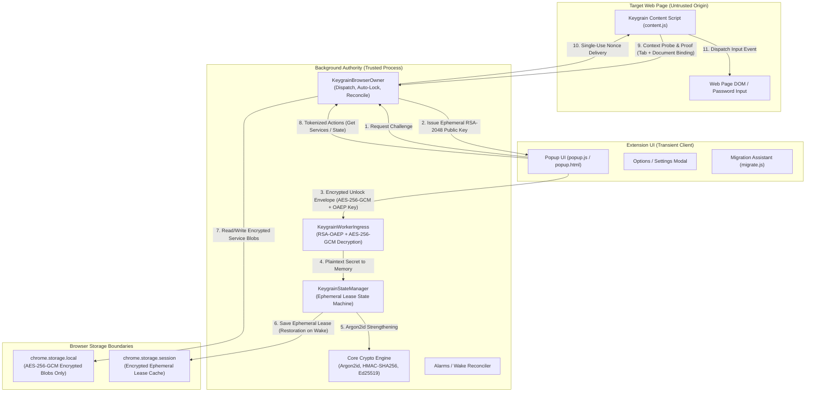
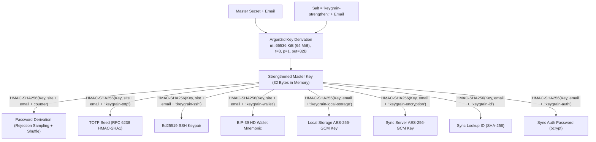
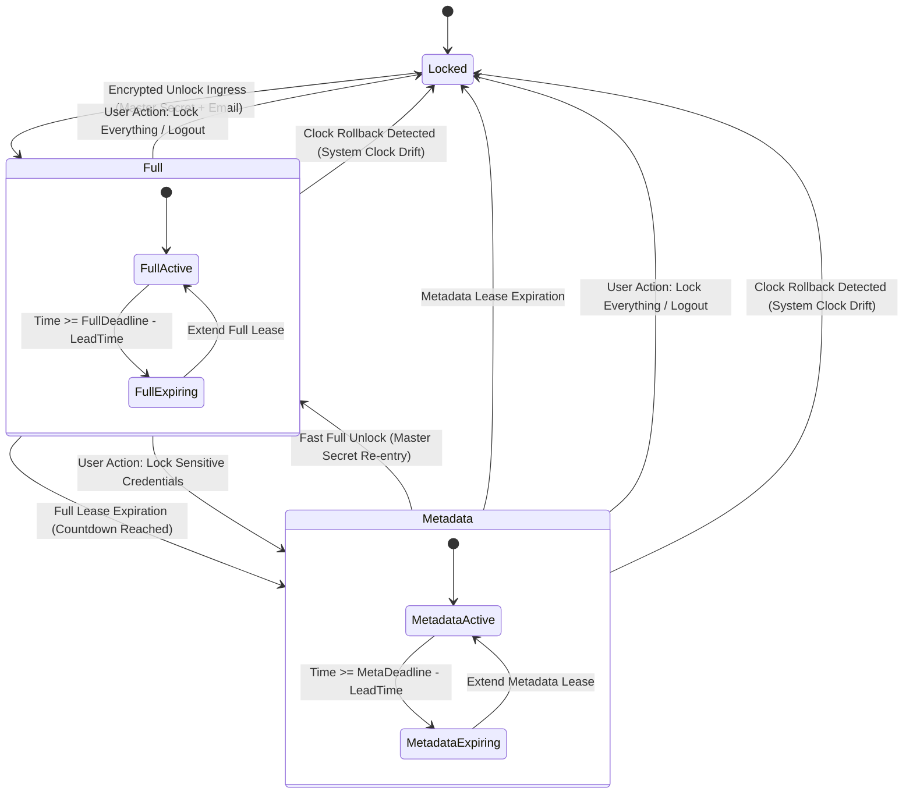
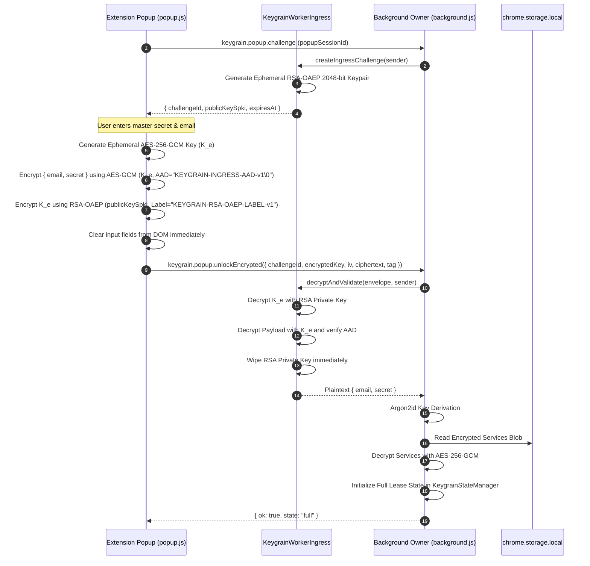
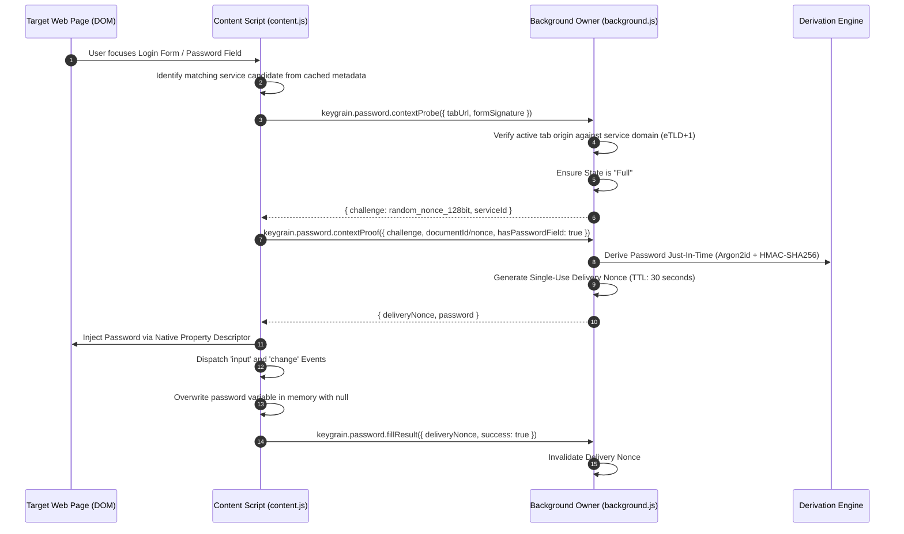
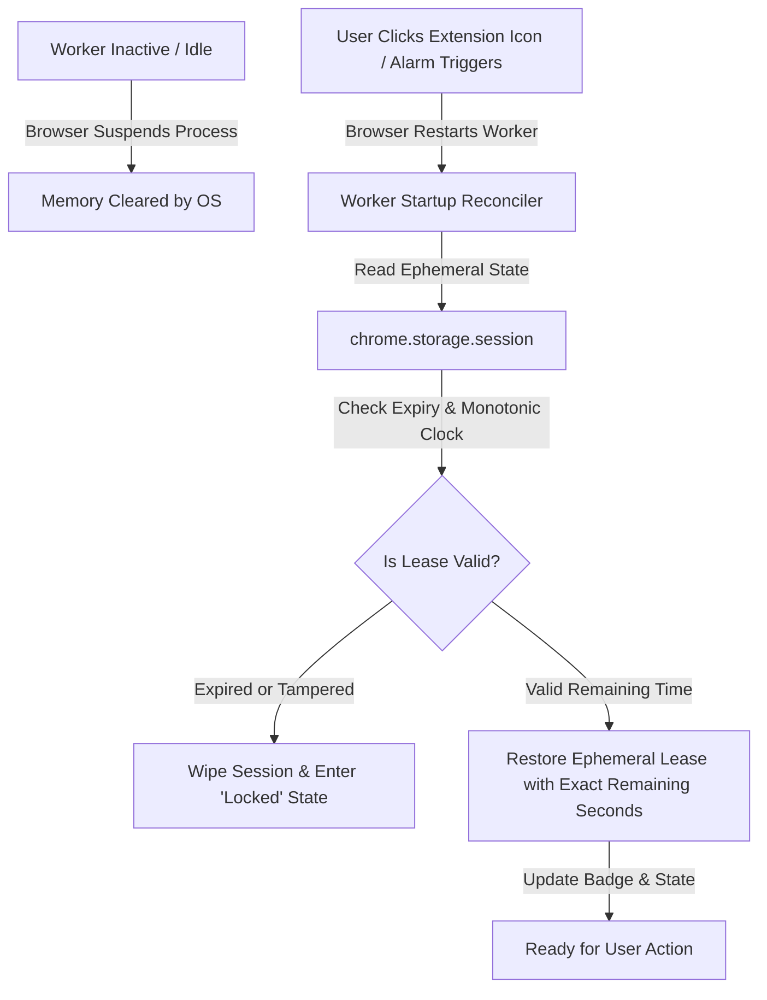

# Keygrain Extension — Security & Privacy Architecture

## 1. Executive Summary & Core Philosophy

Keygrain is a **deterministic, zero-knowledge, zero-vault** credential derivation system. Unlike traditional password managers that store encrypted vaults of static passwords on cloud servers or local disks, Keygrain derives cryptographic secrets (passwords, TOTP seeds, Ed25519 SSH keys, and BIP-39 cryptocurrency wallets) on demand directly from a single master secret combined with service metadata.

Because Keygrain's value proposition is fundamentally built on **uncompromising security and user privacy**, the browser extension is engineered around a **Worker-Authoritative Execution Model** with **Zero Plaintext Persistence** and **Ephemeral Dual-Tier Lease State Machines**.

### Core Security Invariants

1. **Zero Plaintext Persistence**: Master secrets, strengthened keys, and derived credentials never touch persistent disk storage (`localStorage`, `chrome.storage.local`, `IndexedDB`, or cookies).
2. **Worker Authority**: The background service worker (Chrome MV3) / background page (Firefox) is the sole authority for cryptographic key derivation, local decryption, and state lifecycle management. The user interface (popup, settings, dialogs) and content scripts operate as untrusted, bounded projection clients.
3. **Encrypted Ingress**: User master secrets submitted in the popup never travel as plaintext across extension message boundaries; they are encrypted using an ephemeral hybrid RSA-OAEP / AES-256-GCM ingress protocol generated per unlock challenge.
4. **Ephemeral Dual-Tier Lease Management**:
   - **Full Unlock State**: Strengthened key and master secrets exist only in volatile worker memory for a strictly bounded duration (default 5 minutes, configurable up to 15 minutes, with explicit user confirmation for extended sessions).
   - **Metadata Tail State**: When the full lease expires, the extension automatically drops the strengthened key and sensitive credentials from memory while retaining safe service metadata (site names, emails, service IDs) to facilitate UI browsing. Deriving any secret requires fresh full re-authentication.
   - **Locked State**: All runtime state and metadata are wiped from memory.
5. **Bounded Just-In-Time Autofill**: Content scripts cannot inspect or request arbitrary passwords. The background worker verifies origin authenticity, validates active tab context, issues a short-lived single-use delivery nonce, and delivers the credential directly to the target input field with a strict 30-second TTL.

---

## 2. Architecture & Component Boundary Model

### Component Roles & Boundaries

| Component | Trust Level | Capabilities | Restrictions |
| :--- | :--- | :--- | :--- |
| **`KeygrainBrowserOwner`** (Background) | **Authoritative Root** | State coordination, Argon2id derivation, blob encryption/decryption, badge indicators, service worker lifecycle. | Never exposes raw strengthened keys or secrets across message ports. |
| **`KeygrainStateManager`** | **Internal Engine** | Manages `Locked`, `Full`, and `Metadata` transitions, lease deadlines, monotonic time checks, operation handles. | Completely isolated inside the background script; never exposed to popup or content scripts. |
| **`KeygrainWorkerIngress`** | **Security Gateway** | Generates ephemeral RSA-2048 keypairs, validates message origins, decrypts incoming unlock envelopes. | Single-use challenge validation; rejects replays and cross-origin calls. |
| **Popup UI (`popup.js`)** | **Transient Client** | Renders service list, captures user search, displays countdown timer, issues tokenized action requests. | No storage access authority; no direct crypto derivation authority; clears all input fields immediately on submission or close. |
| **Content Script (`content.js`)** | **Isolated Client** | Detects input fields, displays inline autofill prompt, injects derived credentials via native property descriptors. | Cannot request arbitrary secrets; must prove document origin; credentials held only in local closures during active injection. |

---

## 3. Cryptographic Foundations & Domain Separation

Keygrain strictly segregates all cryptographic derivations by domain. Even with access to one derived key, an attacker cannot derive keys for other features or services.

### Domain Separation Table

| Purpose | HMAC-SHA256 Message / Suffix | Algorithm & Output Format |
| :--- | :--- | :--- |
| **Password Derivation** | `normalize_site(site) + "\0" + email + "\0" + counter` | Unbiased Rejection Sampling + Fisher-Yates shuffle into selected character set |
| **TOTP Seed** | `normalize_site(site) + "\0" + email + "\0:keygrain-totp"` | 20-byte seed → Base32 TOTP secret (RFC 6238) |
| **SSH Keypair** | `normalize_site(site) + "\0" + email + "\0:keygrain-ssh"` | 32-byte seed → RFC 8032 Ed25519 private & OpenSSH public key |
| **HD Wallet** | `normalize_site(site) + "\0" + email + "\0:keygrain-wallet"` | BIP-39 English 12/24-word mnemonic seed |
| **Local Storage Encryption** | `email + ":keygrain-local-storage"` | 32-byte key for AES-256-GCM local storage encryption |
| **Sync Server Encryption** | `email + ":keygrain-encryption"` | 32-byte key for AES-256-GCM payload encryption |
| **Sync Lookup ID** | `email + ":keygrain-id"` | Hex-encoded identifier for account lookup on sync server |
| **Sync Authentication** | `email + ":keygrain-auth"` | Password for HTTP Basic Auth with sync server |

---

## 4. Ephemeral Lease State Machine

The extension enforces strict lifecycle states managed by `KeygrainStateManager`:

### State Definitions & Memory Footprint

| State | In-Memory Data | Capabilities Available | Transitions Allowed |
| :--- | :--- | :--- | :--- |
| **`Locked`** | • Zero credentials • Zero metadata • State snapshot = `{state: 'locked'}` | • None (login prompt displayed) | → `Full` via Ingress Unlock |
| **`Full`** | • Master secret & strengthened key • Decrypted services & full collections • Active expiration timer | • In-page password & TOTP autofill • SSH key and wallet derivation • Service CRUD and Sync operations | → `Metadata` (on expiry or user click) → `Locked` (on logout or clock rollback) |
| **`Metadata`** | • Sanitized service records (`id`, `site`, `name`, `email`) • Strengthened key and secrets **permanently purged** | • View and search service names • Copy public service metadata | → `Full` (requires secret re-entry) → `Locked` (on expiry or logout) |

---

## 5. Message Ingress Security Protocol

To prevent malicious browser extensions, rogue tabs, or extension context XSS from intercepting user credentials, the extension implements the **Keygrain Ingress Protocol v1**:

### Ingress Security Guarantees
- **Single-Use Public Keys**: Every unlock challenge produces a fresh RSA-OAEP 2048-bit keypair that expires in 60 seconds and is destroyed immediately upon first decryption attempt.
- **Authenticated Additional Data (AAD)**: The AES-GCM envelope binds the protocol version string `KEYGRAIN-INGRESS-AAD-v1\0` to prevent cross-protocol ciphertext injection.
- **Origin Validation**: Worker verifies `sender.id === chrome.runtime.id` and validates that the sender URL matches the internal extension page origin.

---

## 6. Secure Autofill & Delivery Nonce Handshake

Content scripts execute in the context of untrusted third-party web pages. Keygrain ensures that content scripts can never access persistent secrets or query arbitrary credentials.

### Autofill Security Defenses
- **eTLD+1 Strict Domain Matching**: Derivations are bound to the verified top-level private domain of the active tab. A malicious page at `evil-example.com` cannot trigger derivation for `example.com`.
- **Framework-Proof Injection**: Uses `Object.getOwnPropertyDescriptor(HTMLInputElement.prototype, 'value').set` to inject credentials safely into React, Angular, Vue, and vanilla DOM inputs without exposing passwords to page script event listeners.
- **Delivery Nonce Lifecycle**: Nonces expire strictly after 30 seconds or upon first delivery confirmation, preventing replay attempts.

---

## 7. Service Worker Suspension & Resumption Architecture

In Manifest V3, background service workers are frequently terminated by the browser during periods of inactivity (typically after 30 seconds). Keygrain preserves the security boundaries of active leases across worker restarts:

1. **Session-Scoped Storage**: Ephemeral lease metadata is stored in `chrome.storage.session`, which is maintained in memory by the browser process and **never written to disk**. When the browser quits, all session data is permanently erased.
2. **Clock Rollback Guard**: On every wake reconciliation, `KeygrainStateManager` compares current system time against the last recorded monotonic timestamp. If time has shifted backwards (e.g. user rolled back system clock to prolong an unlock lease), all leases are immediately invalidated and the extension fails closed into `Locked` state.
3. **Exact Deadline Preservation**: Extending worker life or waking after suspension never extends the original lease duration; remaining time is calculated precisely as `expiresAt - now()`.

---

## 8. Threat Model & Security Assurance

| Threat Scenario | Attacker Capability | Keygrain Defense & Mitigation |
| :--- | :--- | :--- |
| **Disk Forensics / Lost Device** | Attacker inspects local disk files and database storage. | **Zero Plaintext**: Local storage contains only AES-256-GCM ciphertext blobs. Master secrets, passwords, and strengthened keys are never persisted to disk. |
| **Malicious Web Page (XSS in target site)** | Target page script tries to harvest passwords or hijack extension. | **Isolated World & Origin Binding**: Content scripts run in isolated execution worlds. Derivations are bound to verified tab origins. Content script cannot request passwords for other sites. |
| **Extension Context Injection / Compromised Frame** | Rogue iframe tries to send messages to background script. | **Trusted Origin Check & Document ID**: Background worker verifies sender origin against `chrome.runtime.id` and validates internal page identifiers before processing any RPC message. |
| **Message Sniffing between UI and Worker** | Malicious extension component inspects internal messages. | **Ingress Hybrid Encryption**: Unlock credentials are RSA-OAEP + AES-GCM encrypted in the UI before transmission and decrypted strictly inside the background worker. |
| **Extended Inactivity / Forgotten Unlocked Browser** | Browser left open while user steps away. | **Dual-Tier Expiry**: Full unlock lease expires automatically (default 5m). Metadata tail expires automatically. Session storage wiped on browser exit. |
| **Side-Channel Timing Analysis on Character Selection** | Attacker measures password generation time to infer characters. | **Rejection Sampling**: Constant-time unbiased byte discarding without modulo bias; eliminates character bias and timing leaks. |

---

## 9. Conclusion

Keygrain's architecture eliminates the fundamental vulnerability of password managers: the static vault database. By combining deterministic on-demand derivation with a worker-authoritative model, ephemeral dual-tier leasing, encrypted message ingress, and bounded autofill delivery, Keygrain delivers a password manager that provides mathematical certainty in privacy and security.
